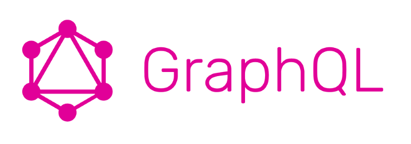

# Документация GraphQL.js

https://graphql.org/graphql-js/ перевод на русский

> **GraphQL** не привязан к какому-либо языку или технологии, но **graphql.js** - это его реализация в языке **JavaScript**. Поэтому данная документация особенно важна для 
> разработчиков **GraphQL** в среде **Express**, и для таких клиентов, как **Apollo** или **Relay**.

## Содержание

* Руководство по GraphQL.js
  * [Начало работы с GraphQL.js](getting-started-with-graphql-js.md)
  * [Запуск Express + GraphQL](running-express-server.md)
  * [GraphQL-клиенты](graphql-clients.md)
  * [Основные типы](basic-types.md)
  * [Передача аргументов](passing-arguments.md)
  * [Типы объектов](object-types.md)
  * [Мутации и типы Input](mutations-and-input-types.md)
  * [Аутентификация и Middleware Express](authentication-and-express-middleware.md)
* Продвинутые темы
  * [Конструирование типов](constructing-types.md)
* Справочник API
  * [express-graphql](express-graphql.md)
  * [graphql](graphql.md)
  * [graphql/error](error.md)
  * [graphql/execution](execution.md)
  * [graphql/language](language.md)
  * [graphql/type](type.md)
  * [graphql/utilities](utilities.md)
  * [graphql/validation](validation.md)

