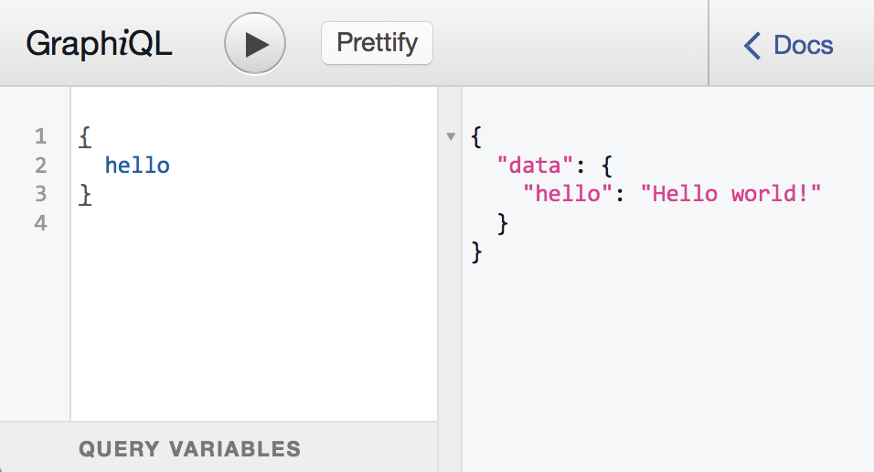

# Запуск Сервера Express GraphQL

Самый простой способ запустить сервер API GraphQL - использовать [Express](https://expressjs.com/ru/){:target="_blank"}, популярную среду веб-приложений для Node.js. Вам нужно будет установить две дополнительные зависимости:

```bash
npm install express express-graphql graphql --save
```

Давайте изменим наш пример «hello world» так, чтобы это был API-сервер, а не скрипт, выполняющий один запрос. Мы можем использовать модуль «express» для запуска веб-сервера, и вместо того, чтобы выполнять запрос напрямую с помощью функции **graphql**, мы можем использовать библиотеку **express-graphql** для монтирования сервера API GraphQL на эндпойнт HTTP "/graphql":

```
var express = require('express');
var graphqlHTTP = require('express-graphql');
var { buildSchema } = require('graphql');

// Construct a schema, using GraphQL schema language
var schema = buildSchema(`
  type Query {
    hello: String
  }
`);

// The root provides a resolver function for each API endpoint
var root = {
  hello: () => {
    return 'Hello world!';
  },
};

var app = express();
app.use('/graphql', graphqlHTTP({
  schema: schema,
  rootValue: root,
  graphiql: true,
}));
app.listen(4000);
console.log('Running a GraphQL API server at http://localhost:4000/graphql');
```

Вы можете запустить этот сервер GraphQL с помощью:

```bash
node server.js
```

Поскольку мы настроили ```graphqlHTTP``` с помощью ```graphiql: true```, вы можете использовать инструмент GraphiQL для ручной выдачи запросов GraphQL. Если вы перейдете в веб-браузере по адресу ```http://localhost:4000/graphql```, вы должны увидеть интерфейс, позволяющий вводить запросы. Это должно выглядеть так:



Этот скриншот показывает, что GraphQL-запрос ```{hello}``` выполняется и дает результат ```{data: {hello: 'Hello world!' }}```. GraphiQL - отличный инструмент для отладки и проверки сервера, поэтому мы рекомендуем запускать его, когда ваше приложение находится в режиме разработки.

К этому моменту вы узнали, как запустить сервер GraphQL и как использовать интерфейс GraphiQL для выдачи запросов. Следующий шаг - научиться [создавать запросы GraphQL из клиентского кода](graphql-clients.md).